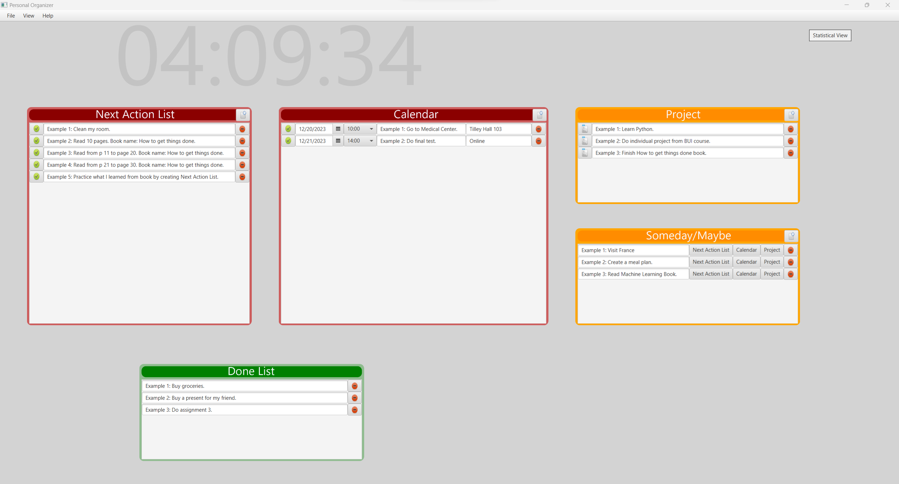

# Individual Project: OrganizeMe

## Project Overview

Welcome to OrganizeMe, a JavaFx desktop application designed to revolutionize your daily organization. Inspired by a personal productivity system used and refined over five years, this application brings your to-do lists, calendars, projects, and someday/maybe lists to a single, streamlined platform.

## Key Features

### What OrganizeMe is Useful For:

***Create and Manage Your:***
- To-Do Lists
- Calendars
- Projects
- Someday/Maybe Lists

## Implementation Requirements

To ensure a seamless user experience and effective functionality, OrganizeMe adheres to the following implementation requirements:

- **Good Design Heuristics:** The application prioritizes good design principles for optimal usability.

- **CRAP Design Implementation:** Emphasis is placed on Contrast, Repetition, Alignment, and Proximity for a visually appealing interface.

- **MVC Design:** The application follows the Model-View-Controller (MVC) architecture for efficient data management and presentation.

- **Multiple Views:** OrganizeMe offers two distinct views for certain aspects of the model, enhancing user flexibility.

- **Splash Screen:** A captivating splash screen welcomes users upon application launch.

- **Menu Bar:** Featuring relevant content, the menu bar includes a Help menu for user assistance.

- **Help Menu:** A comprehensive Help menu includes a Help Screen and an About section, displaying the application logo and creator's name.

- **Consistent Look and Feel:** The application maintains a cohesive and appropriate visual identity, encompassing colors, fonts, and overall aesthetics.

- **Custom Widgets:** OrganizeMe boasts several custom-designed widgets facilitating information entry and display.

- **Interaction with Model:** Users can interact with and enter information for at least three different types of domain objects.

- **Domain Object Management:** The application allows the creation, editing, updating, changing, and deletion of domain objects through user-friendly actions.

- **Exemplary Domain Objects:** A set of exemplary domain objects is pre-populated to provide users with a starting point.

## Additional Details

For a deeper understanding of the OrganizeMe project, refer to the one-page report available in [REPORT.md](REPORT.md). This report delves into the project's intricacies, providing valuable insights into its development and functionality.